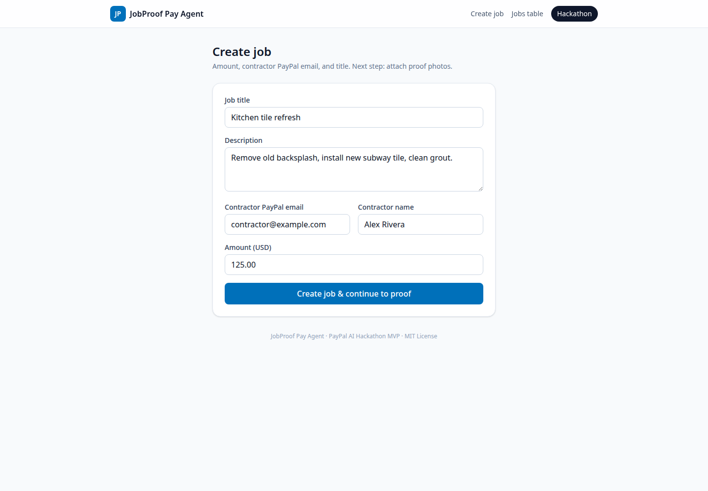

# JobProof Pay Agent

**Prove the work. AI unlocks the Pay. PayPal moves the money.**

Hackathon MVP for the [PayPal AI Hackathon](https://paypalaihackathon.devpost.com/).

Contractor finishes a job → uploads before/after proof photos → local/heuristic AI scores completeness → on **pass**, a PayPal agent creates a **sandbox Order** (customer pay) and optionally a **Payout** to the contractor.

<!-- product-screenshots:start -->
## Product screenshots

Job creation form with the app’s built-in demo values, before proof upload or payment processing.



Captured from the [live UI](https://jobproof-pay-agent.vercel.app/jobs/new) on October 2, 2026. No payment, generation, or other action was submitted to create this capture.
<!-- product-screenshots:end -->

## Live demo

- **Hosted app:** https://jobproof-pay-agent.vercel.app
- **Demo video:** [docs/jobproof-pay-agent-demo.mp4](./docs/jobproof-pay-agent-demo.mp4)
- **Thumbnail:** [docs/thumbnail.png](./docs/thumbnail.png)
- **Devpost draft copy:** [DEVPOST.md](./DEVPOST.md)

## Stack

- Next.js 15 (App Router) + TypeScript + Tailwind CSS
- PayPal REST sandbox: **Orders v2** (create + capture) + **Payouts**
- `@paypal/agent-toolkit` (AI SDK tools: `create_order`, `get_order`, `pay_order`)
- Deterministic local AI scorer (works **without** `OPENAI_API_KEY`)
- JSON file store (`data/jobs.json`)
- Deploy-ready for Vercel

## Quick start

```bash
cd jobproof-pay-agent
cp .env.example .env.local
npm install
npm run dev
```

Open [http://localhost:3000](http://localhost:3000).

### Demo path (no PayPal keys)

1. **Create job** — amount + contractor PayPal email + title  
2. **Attach sample proofs** — e.g. “Use kitchen samples”  
3. **Run AI score** — expect PASS (~70+); method `local`  
4. **Create PayPal order** — runs in **demo mode** (IDs prefixed `DEMO-`)  
5. **Capture + payout** — simulated success screen  

Health check: `GET /api/health` · Agent explain: `GET /api/agent`

### Real sandbox money movement (for judges)

1. Create a [PayPal Developer](https://developer.paypal.com/dashboard/) app (Sandbox).
2. Copy **Client ID** and **Secret** into `.env.local`:

```env
PAYPAL_CLIENT_ID=...
PAYPAL_CLIENT_SECRET=...
PAYPAL_MODE=sandbox
NEXT_PUBLIC_PAYPAL_CLIENT_ID=...
```

3. Restart `npm run dev`.
4. Repeat the demo path. “Create PayPal order” uses Agent Toolkit / Orders v2 and redirects to PayPal sandbox approval.
5. Log in with a **sandbox Personal (buyer)** account from Developer Dashboard → Sandbox → Accounts.
6. After approval you return to `/jobs/[id]/success` which **captures** the order and attempts a **Payout** to the contractor email (use a sandbox Business/Personal email that can receive payouts).

> **Payouts note:** Sandbox payouts require the app to have Payouts enabled and a funded sandbox business account. If payout fails after a successful capture, the job still shows as `paid` and you can retry via the API.

Optional: set `OPENAI_API_KEY` to augment the completeness score. The local scorer always remains the fallback.

Optional: set `JEV_API_KEY` to run a text-only Jev (TypeSafe System One) gate before a contractor payout. One call sends who, amount, and reason — not proof photos — and asks for an **approve** / **hold** Choice plus a dispute check. The sandbox Payouts call runs only when the Choice is approve, confidence is at least 0.85, and the note does not dispute the payout. That result does not send money and is not a legal judgment. Anything else, including a failed call, does not create a payout. Leave the key empty to keep today's payout path with no Jev call. The default endpoint is `https://thejevai.com/v1/systemone` (same body as `https://api.typesafe.ai/v1/systemone`). Override with `JEV_API_URL` or `JEV_MODEL` if you need to.

## Scripts

| Command | Description |
| --- | --- |
| `npm run dev` | Dev server (Turbopack) |
| `npm run build` | Production build |
| `npm start` | Serve production build |
| `npm run lint` | ESLint |

## UX pages

| Route | Purpose |
| --- | --- |
| `/` | Home pitch |
| `/jobs/new` | Create job |
| `/jobs/[id]` | Proof upload → AI score → PayPal pay |
| `/jobs/[id]/success` | Capture / success |
| `/jobs` | Jobs table (sponsor-friendly grid) |

## PayPal APIs used

| Capability | API | How |
| --- | --- | --- |
| OAuth | `POST /v1/oauth2/token` | Client credentials |
| Create order | `POST /v2/checkout/orders` | Agent Toolkit `create_order` + REST fallback |
| Capture | `POST /v2/checkout/orders/{id}/capture` | Toolkit `pay_order` + REST fallback |
| Payout | `POST /v1/payments/payouts` | Direct REST to contractor email |

Agent status: `GET /api/agent`.

## Deploy on Vercel

1. Import this repo in Vercel (or `vercel` CLI).
2. Set env vars from `.env.example` (sandbox credentials).
3. Deploy. Serverless functions use the same App Router API routes.
4. Note: the default JSON store is ephemeral on serverless. For a durable demo, swap `src/lib/store.ts` to Vercel KV / Postgres, or run a long-lived Node host. For judges running locally, the file store is fine.

## Project layout

```
src/app/           # App Router pages + API
src/components/    # UI
src/lib/           # store, AI scorer, PayPal REST + agent toolkit
public/samples/    # before/after demo images
data/              # jobs.json (runtime)
DEVPOST.md         # Submission copy draft
```

## License

MIT — see [LICENSE](./LICENSE).
